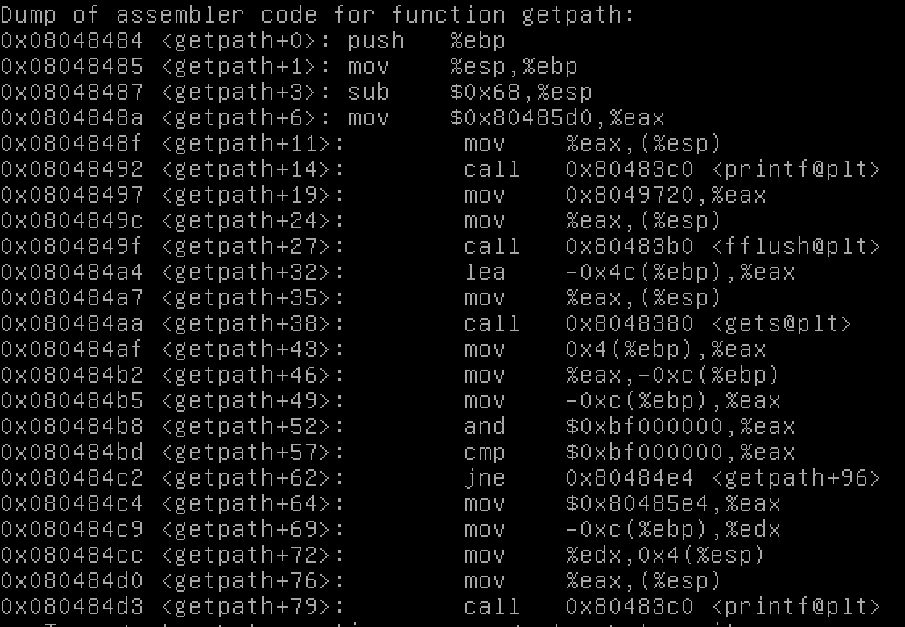

###Stack 6 Exploit

####Introduction

This is similar to other stack exploits, but with a slightly inconvient security feature. The source code implements a rough
check to verify if the return address of a function is pointing to the stack. If it is, it will not execute the code.
Below is the source code:
```
#include <stdlib.h>
#include <unistd.h>
#include <stdio.h>
#include <string.h>

void getpath()
{
  char buffer[64];
  unsigned int ret;

  printf("input path please: "); fflush(stdout);

  gets(buffer);

  ret = __builtin_return_address(0);

  if((ret & 0xbf000000) == 0xbf000000) {
      printf("bzzzt (%p)\n", ret);
      _exit(1);
  }

  printf("got path %s\n", buffer);
}

int main(int argc, char **argv)
{
  getpath();


}
```

####Exploit

We will get around this functionality by executing what is known as a `ret2libc` command. Essentially, we will set the return
address of the function to be a a `libc` library function which is stored on the heap and is always executable. We can feed these 
functions arbitary arguements and get them to execute.  

As we know, the order of a stack frame goes: 
```
function address
return address
parameters
```

So for our program to exit gracefully without causing a segfault and potentially alerting monitors our exploit stack frame should look
like:
```
address of puts()
address of exit()
parameter for puts(), "Hi Ben!"
```

So first lets find the address of puts() and exit().  

Lets run our exploit program in `gdb`
`gdb ./stack6`
`run`
now enter any charcater to advacne the program.
Now we can load the addresses of libc functions
`p puts`
This outputs `$1 = {<text variable, no debug info>} 0xb7ef4780 <_IO_puts>`  
This shows us the address of `puts` is `0xb7ef470`  
Doing the same for `exit` shows us that its adddress is `0xb7ec60c0`

Now we need to find a buffer that we can overflow in order to write the return address of `getpath` to be the address of `puts`
To do this we can call our program again with `gdb ./stack6`
Now lets disassemble the `getpath` function 
Run `disas getpath` you should see output like:

We can identify the location of the buffer being allocated for looking for the `lea` assembly command. This command is called when
memory is allocated. We can see its memory address is `-0x4c(%ebp)`.  
What that is saying is that the buffer is allocated 76 (0x4c) bytes before the EBP pointer. Since we know that the return address
is stored 4 bytes after the EBP pointer we know whatever we right 80 bytes into our buffer will be the new return address. Now lets
create a string to do this. 
I'm going to pipe some python into a file to run.   
`'python -c '"B"*80 +"\x80\x47\xef\xb7"+"\xc0\x60\xec\xb7"+"Hi ben"' > /tmp/payload`
So this creates a string that looks like `BBBBBB...(80 Bs)<Address of puts><Address of exit><Parameter passed to puts>`  

So now `./stack6 < /tmp/payload` will execute the folllowing after returning from `getpath`:
```
puts("Hi ben");
exit()
```
